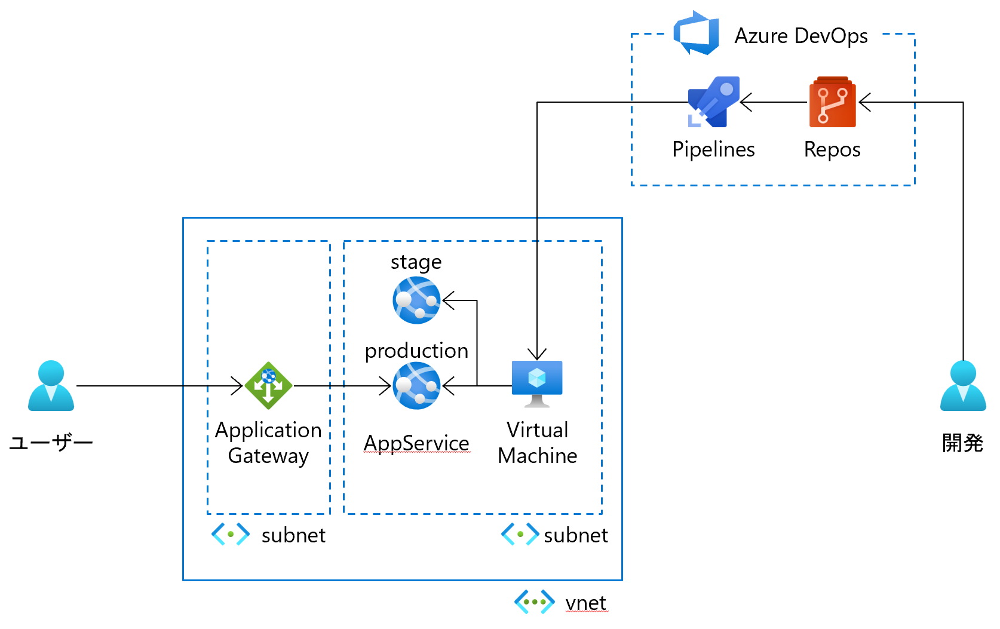
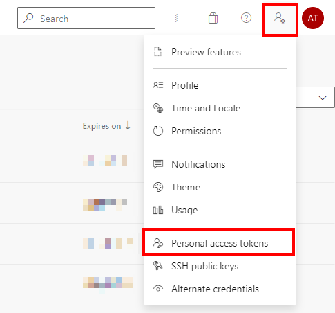

Azure DevOps Demo
===

## 環境



## 構築手順

目次

1. Azure上のインフラ準備
1. Azure DevOps の準備
    1. 組織作成
    1. プロジェクト作成
    1. Azureへの接続設定
1. Azure VMにエージェントの導入
1. Azure DevOps のパイプライン作成


### Azure上のインフラ準備

1. Azure へログイン
1. Azure Cloud CLI を起動（Bash）
1. GitHub リポジトリから本リポジトリをダウンロード

    ```
    git clone <URL>
    ```

1. `terraform` フォルダ（ `/infra/terraform` ）へ移動
1. 変数ファイル（ `/infra/terraform/terraform.tfvars` ）として以下の変数を作成

    ```
    TENANT_ID       = {tenant id}         # テナントID
    SUBSCRIPTION_ID = {subscription id}   # サブスクリプションID
    location        = "japaneast"         # 展開するリージョン名
    prj             = {project name}      # プロジェクト名。接頭辞に利用。任意。例：azure-devops
    env             = {environment name}  # 環境名。接頭辞に利用。任意。例：test
    username        = {agent vm user}     # エージェントVMのユーザー名
    password        = {agent vm password} # エージェントVMのパスワード
    ```

1. 初期化、適用を実施

    ```
    az login
    az account set -s <SUBSCRIPTION_ID>
    terraform init
    terraform apply -auto-approve
    ```

###  Azure DevOps の準備

1. 自分の Azure DevOps アカウントへアクセス

    https://aex.dev.azure.com/me

1. テスト用の組織がなければ「新しい組織の作成」から新規作成
1. テスト用の組織で「新しいプロジェクト」リンクを選択
    1. "Create new project"で以下を設定して「Create」
        |項目|値|
        |---|---|
        |Project name|任意|
        |Visibility|Private|
1. 作成したテストプロジェクトを開く
1. [Repos]-[Files]を開いてリポジトリURLを取得
1. ローカルにクローン

    ```
    git clone <URL>
    ```

1. 手元にダウンロードしておいた本リポジトリをクローンしたフォルダにコピー

    ```
    [本リポジトリ]
        ↓ コピー
    [作成したテストリポジトリ]
    ```

1. コミット＆プッシュ


###  Azure DevOps に connection 設定

1. 自分の Azure DevOps アカウントへアクセス
1. テストプロジェクトを開く
1. [Project settings]を開く
1. [Pipelines]-[Service connections]を開く
1. 「Create service connection」を選択
    1. 「Azure Resource Manager」を選択
    1. 「Service principal (automatic)」が選択されていることを確認して「Next」を選択
    1. 以下を設定
        |項目|値|
        |---|---|
        |Scope level| `Subscription` |
        |Subscription| 展開したインフラを含む サブスクリプション |
        |Resource group| 展開したインフラを含む リソースグループ |
        |Service connection name| 任意 |


### Azure DevOps エージェントの作成

PAT(Personal Access Token)取得

1. 自分の Azure DevOps アカウントへアクセス
1. テストプロジェクトを開く
1. [User settings]-[Personal access tokens] を開く
    
1. 「New Token」からトークンを新規作成
    1. 以下を設定して「Create」
        |項目|値|
        |---|---|
        |Name| 任意 |
        |Scopes| `Agent Pools` に対して `Read & manage` を設定 <br /> `Agent Pools` は最初見えていないので左下の`Show all scopes` を選択して設定する |
        |||
    1. トークンが表示されるのでメモする

エージェントダウンロードリンク取得

1. 自分の Azure DevOps アカウントへアクセス
1. テストプロジェクトを開く
1. [Project settings]を開く
1. [Pipelines]-[Agent pools]を開く
1. 「Default」エージェントプールを開く
1. 「New agent」を選択
1. エージェントのダウンロードリンクをコピー

VMにエージェントをインストール

1. VMへログイン
1. 前述手順で取得したエージェントダウンロードリンクを使ってエージェントをダウンロード
1. ダウンロードした zipファイル の中身を `C:\agents` に展開
1. PowerShell を管理者権限で起動
1. `C:\agents` へ移動
1. `config.cmd` の実行

    1. 以下のコマンドで起動
        ```
        PS C:\agents> .\config.cmd
        ```

    1. ウィザードに従って以下を入力
        |項目|値|
        |---|---|
        |Server URL| `https://dev.azure.com/{your-organization}` |
        |Authentication type| `PAT` |
        |personal access token| 事前取得しておいたPATを入力 |
        |agent pool| `Default` (デフォルトのまま) |
        |agent name| 任意(仮想マシン名など) |
        |work folder| `_work` (デフォルトのまま) |
        |agent as service| `Y` |
        |User account to use for the service| `NETWORK SERVICE` (デフォルトのまま) |
        |prevent service starting immediately| `N` (デフォルトのまま） |

    1. 問題なく設定できていれば `Azure Pipelines Agent (xxxx)` のサービスが起動している


VMにビルドツールをインストール

1. VMへログイン
1. Visual Studio Build Tools 2022 をダウンロード

    https://visualstudio.microsoft.com/ja/thank-you-downloading-visual-studio/?sku=BuildTools&rel=17

1. インストールを開始
1. 以下を選択してインストール
    * [Web & Cloud]カテゴリ
        * Web development build tools
        * Azure development build tools
1. インストール後、再起動


### パイプラインの作成

ビルドパイプラインの作成

1. Azure DevOps のプロジェクトを開く
1. [Pipelines]-[Pipelines]を開く
1. 「Create Pipeline」の横にあるメニューから「Import pipeline」を選択
1. `/pipelines/project-ASP.NET-CI.json` を開いて「Import」
1. 設定変更
    1. Pipelines
        |項目|値|
        |---|---|
        |Name|任意に修正|
        |Agent pool| `Default` |

    1. Git sources
        |項目|値|
        |---|---|
        |Team project| テストプロジェクトに修正 |
        |Repository| テストリポジトリに修正 |
    1. 画面上部のメニューから「Save」
1. [Pipelines]-[Releases]を開く
1. 「New Pipeline」を選択
1. 適当なパイプラインを作成（←後で削除する）
1. の横にあるメニューから「Import pipeline」を選択
1. 「＋New」を開いて「Import release pipline」を選択
1. `/pipelines/project-ASP.NET-CD.json` を開いて「Import」
1. 設定変更
    1. Artifacts
        1. もともとある作成されたものを削除
        1. 「＋Add」から作成
            |項目|値|
            |---|---|
            |Project|現在のプロジェクトを選択|
            |Source|直前に作成したビルドパイプライン|
            |Source alias|`drop`|
        1. Continuous deployment trigger を有効化
            |項目|値|
            |---|---|
            |Build branch fileters|masterブランチ|

    1. `Deploy` ステージ
        1. Deploy
            |項目|値|
            |---|---|
            |Azure subscription| 作成済みの service connection |
            |App type| `Web App on Windows` |
            |App service name| インフラ構築で作成された App Service |
        1. Run on agent
            |項目|値|
            |---|---|
            |Agent pool| `Default` |
        1. Deploy Azure App Service
            |項目|値|
            |---|---|
            |Resource group| インフラ展開先のリソースグループ |
            |Slot| `staging` |
            |||
    1. `Release` ステージ
        1. Pre-deployment conditions
            |項目|値|
            |---|---|
            |Approvers| 任意のユーザー |
        1. Run on agent
            |項目|値|
            |---|---|
            |Agent pool| `Default` |
        1. Swap Slots
            |項目|値|
            |---|---|
            |Azure subscription| 作成済みの service connection |
            |App service name| インフラ構築で作成された App Service |
            |Resource group| インフラ展開先のリソースグループ |
            |Source Slot| `staging` |

    1. 「Save」で保存
1. 最初に作ったダミーのパイプラインは削除


### 動作確認

1. `/app/WebApplication1.sln` を開く
1. `/Views/Index.cshtml` を修正
1. コミット＆プッシュ
1. 自動ビルドされてステージ環境へリリースされる
1. エージェントVMからアクセスして修正確認
1. メールが届いているので確認、承認を実施
1. 本番と検証がスイッチして本番にリリースされる

